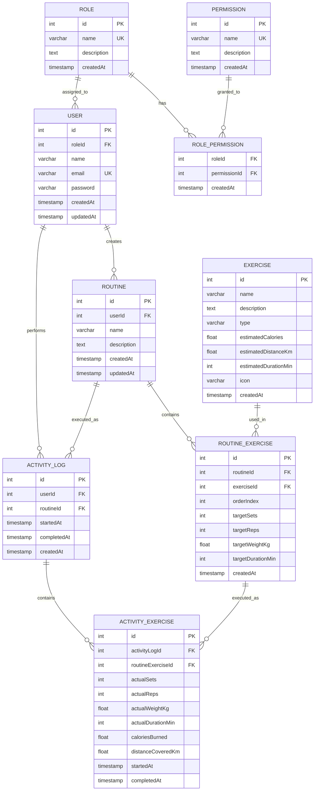

# Interfaces 3 - 2026 02

## Sistema de Gestión de Rutinas y Actividad Física

Una empresa que ofrece servicios relacionados con el bienestar y la actividad física desea desarrollar una aplicación para ayudar a sus usuarios a organizar sus entrenamientos y llevar un control de su progreso. Actualmente, muchas personas utilizan hojas de cálculo, notas en el celular o aplicaciones genéricas para registrar sus actividades, lo que dificulta mantener un historial ordenado y consultar los resultados obtenidos a lo largo del tiempo. Por esta razón, se busca construir una solución que permita a cada usuario crear planes de entrenamiento personalizados, compuestos por diferentes actividades físicas, y utilizarlos durante sus sesiones diarias. Cuando una persona realice un entrenamiento, la aplicación deberá permitir registrar lo que efectivamente hizo, ya que en ocasiones los resultados obtenidos pueden diferir de lo que se había planeado inicialmente. También se desea conservar un historial de las sesiones realizadas para que los usuarios puedan revisar su evolución y analizar su desempeño. Adicionalmente, la organización considera importante que no todas las personas tengan acceso a las mismas funcionalidades dentro de la plataforma, por lo que será necesario contemplar diferentes tipos de usuarios con distintos niveles de acceso. Como parte del proyecto, se espera diseñar una solución que permita almacenar y gestionar toda la información necesaria para soportar estas necesidades de negocio de forma organizada y consistente.

<details>
<summary><strong>Ver propuesta de modelo de datos (solución sugerida)</strong></summary>



</details>

## Base de Datos

### Sembrado de Datos Iniciales (Seed)

Para ejecutar el script de inserción de datos iniciales en la base de datos PostgreSQL alojada en Docker, ejecuta el siguiente comando:

```bash
docker compose exec -T db psql -U postgres -d mydatabase < db/scripts/inserts.sql
```
